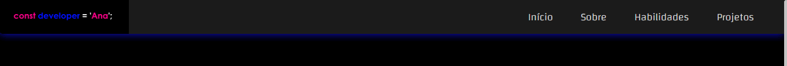
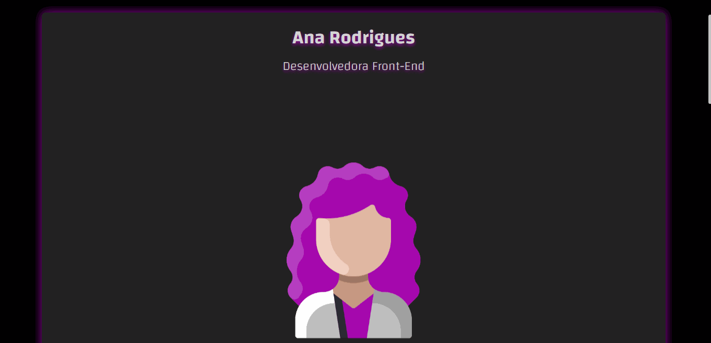
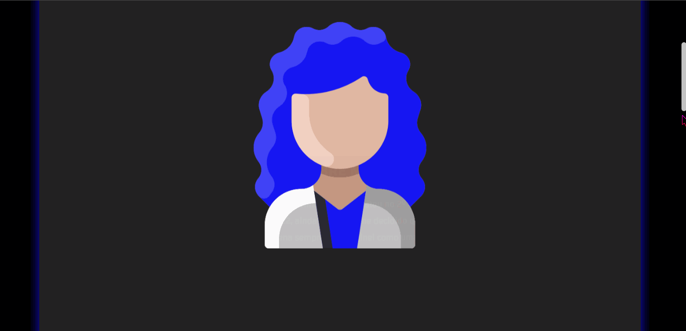

# 💥​ Site portifólio

Esse foi o meu segundo projeto, criado para demonstrar minhas habilidades como Dev Front-End, além de expor outros projetos desenvolvidos para evidênciar meus conhecimentos. 👩‍💻🧠 

### 📌  Você pode acessar o projeto clicando <a href= "https://anarodrigues.vercel.app/"> AQUI </a>  
#### - ou dar uma olhadinha nos gifs do projeto, ao final do readme. <3

## ​👩‍💻​ Desenvolvimento

Para desenvolver o projeto, foram utilizadas apenas as tecnologias HTML, CSS e JavaScript. As bibliotecas ScrollRevealJS e FontAwesome também foram manuseados durante o desenvolvimento. Foram aplicados conhecimentos prévios de responsividade, usufruindo do recurso Media Query. 

<!--Dentro do portifólio na seção "Projetos" se encontra o meu primeiro projeto, você pode obter o código fonte <a href="https://github.com/devanarodrigues/DC"> aqui. </a>-->

## 🚀 Sobre mim

Eu sou a Ana ✨​, desenvolvedora Front-End. Atualmente estou terminando o ensino médio. Decidi estudar programação como curiosidade e acabei gostando muito de programar. O resto você encontra no "Sobre mim" dentro do portifólio. <3

## 💡 Aprendizados

Nesse projeto eu coloquei em prática muitos conteúdos vistos em cursos, e também fui atrás de muitas outras funcionalidades que ainda não conhecia. Aperfeiçoei meu conhecimento em diversos componentes e aprendi a sanar minhas dúvidas sozinha. 👸

## 💢 Demonstração
#### - Topo da página
 
#### - Animação principal
 
#### - Sobre mim, experiência e habilidades
 
#### - Projetos
 
#### - Rodapé
 
#### - Responsividade (320x590)
 

##### Você pode conferir meus outros projetos clicando <a href= "https://anaprojetos.vercel.app/"> AQUI</a>.
#### ⚡ Estou aberta a opiniões construtivas, dicas e ideias.
## - Obrigada por ler até aqui! 💗
